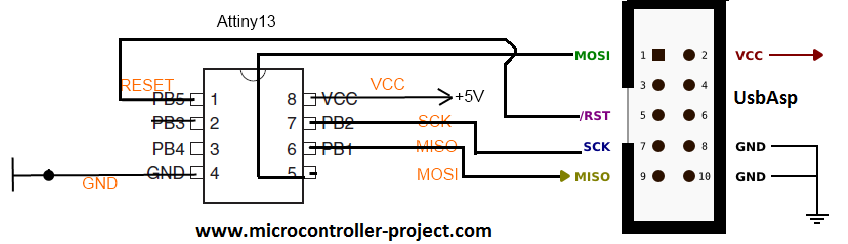

# Прошивка к Трассерной насадке

Эта прошивка подходит для трассерной насадки из этого репозитория.
**Целевой микроконтроллер:** Attiny13 (Архитектура AVR)
**Программатор:** USBASP
**Компилятор:** avr-gcc

## Сборка и прошивка

Для сборки проекта выполните следующую команду из директории, содержащей makefile:

```bash
    make hexing
```

Затем подключите программатор USBASP к микроконтроллеру согласно схеме подключения:



И выполните команду:

```bash
    make flash
```

После чего выполните команду для правильной настройки "фьюзов" микроконтроллера:

```bash
    make write_lfuse_high_frequency
```