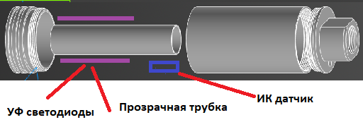
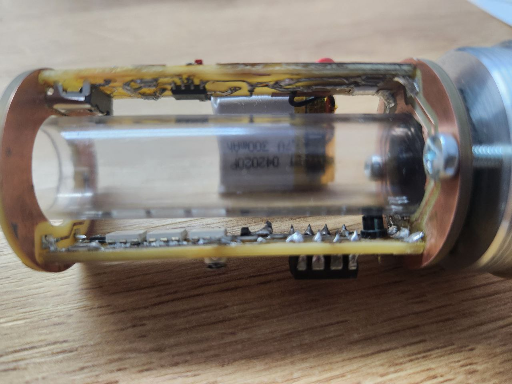

# Трассерная насадка для игры в страйкбол

## Содержание
1. [Цель проекта](#цель-проекта)
2. [Режимы работы](#режимы-работы)
3. [Принцип работы](#принцип-работы)
4. [Необходимые компоненты](#необходимые-компоненты)
5. [Используемые инструменты и станки](#используемые-инструменты-и-станки)
6. [Проблемы и трудности](#проблемы-и-трудности)
7. [Результат](#результат)

## Цель проекта

Разработка и изготовление компактной и надежной трассерной насадки для страйкбольного оружия, которая позволяет визуализировать полет шаров в условиях низкой освещенности. Насадка будет крепиться на ствол оружия на резьбу `M14-` и активироваться при выстреле, подсвечивая траекторию полета шаров с помощью ультрафиолетовых светодиодов. Управление устройством осуществляется на базе микроконтроллера `ATtiny13`, что обеспечивает минимальные габариты и энергопотребление.

## Режимы работы

Трассерная насадка будет иметь `3 режима` работы:
1. Ультрафиолетовая вспышка для подсветки шаров
2. Оранжевая вспышка на срезе ствола для имитации вспышки выстрела
3. Ультрафиолетовая вспышка и имитация вспышки выстрела

## Принцип работы

+ При выстреле страйкбольный шар проходит через ствол, пересекая луч инфракрасного датчика.
+ Датчик передает сигнал на микроконтроллер ATtiny13.
+ Микроконтроллер активирует ультрафиолетовые светодиоды на короткий промежуток времени (0.1 секунду).
+ Светодиоды подсвечивают шар внутри ствола, делая его видимым в темноте.
+ После завершения цикла устройство возвращается в режим ожидания для экономии энергии.

### Идейная схема реализации 

## Необходимые компоненты

Список необходимых компонентов:

### Электроника

| Компонент                         | Количество             |
|-----------------------------------|------------------------|
| Двухсторонний текстолит           | 100x100mm              |
| Микроконтроллер Attiny13          | 1шт                    |
| УФ светодиоды формата 5050        | 3шт                    |
| Оранжевые светодиоды 1206         | 3шт                    |
| SMD переменный резистор 20k       | 1шт                    |
| SMD резистор 0805 10k             | 1шт                    |
| SMD резистор 0805 1k              | 4шт                    |
| SMD резистор 0805 4k              | 1шт                    |
| SMD резистор 1206 20ОМ            | 2шт                    |
| SMD резистор 1206 150ОМ           | 1шт                    |
| SMD транзистор NPN bc817-40       | 2шт                    |
| SMD конденсатор 0603 0.1мкФ       | 2шт                    |
| SMD конденсатор 0603 10мкФ        | 1шт                    |
| Инфракрасный фотодиод 3мм         | 1шт                    |
| SMD инфракрасный светодиод        | 1шт                    |
| SMD светодиод 0603 красный        | 1шт                    |
| SMD светодиод 0603 синий          | 1шт                    |
| SMD микросхема TP4056             | 1шт                    |
| Li-ion аккумулятор 20/20/4мм 3.7В | 1шт                    |
| USB Type-C разъём                 | 1шт                    |
| SMD кнопка                        | 1шт                    |

### Корпус

| Компонент                         | Количество             |
|-----------------------------------|------------------------|
| Алюминиевая труба D = 35мм        | 60мм                   |
| Прозрачная трубка D = 15мм        | 60мм                   |
| Винты M3 15мм                     | 2шт                    |
| Круг алюминиевый Д16-Т D = 40мм   | 60мм                   |
| Прокладка диаметром 15мм          | 1шт                    |
| Круг алюминиевый D = 20мм         | 30мм                   |

## Используемые инструменты и станки

В этом проекте было задействовано следующее оборудование:

### Для изготовления корпуса

Для изготовления корпуса и переходника `M11/M14-` были использованы:

1. Токарно-винторезный станок `JET GHB-1340A DRO` - для токарных работ

2. Редукторный фрезерно-сверлильный станок `JET JMD-45LPFD` - для фрезерно-сверлильных работ

3. Ленточнопильный станок `JET MBS-1011DAP` - для отрезания заготовок

### Для изготовления электроники

1. Настольный фрезерно-гравировальный станок `Charly 4U` - для изготовления печатных плат

2. Осцилограф цифровой `UNI TREND UTD2102CM` - для диагностики схемы

3. Паяльная станция `Ersa i-CON1` с паяльником `i-TOOL 0IC1100A` - для сборки печатной платы

## Проблемы и трудности

В процессе изготовления возникли некоторые трудности, которые пришлось преодолеть

### Неисправность токарного станка

Первой проблемой, которую необходимо было решить это неисправность ходового винта токарного станка. Так как мне было необходимо нарезать нестандартную резьбу, мне нужен был функционирующий ходовой винт на токарном станке, но он был повреждён предыдущими пользователями(срезаны срезные шпильки крепления).

Для решения этой проблемы с помощью другого токарного станка(без возможности нарезания резьбы) `MetalMaster MML2870M` были выточены новые срезные шпильки из латуни и функционирование токарного станка `JET GHB-1340A DRO` было восстановлено.

### Необходимость нарезания резьбы по алюминию

Процесс нарезания резьбы по алюминию представляет некоторую трудность из-за пластичности металла, поэтому если использовать универсальные резьбонарезные пластинки, то резьба получается рваная, вот пример:

Поэтому были куплены специальные резьбонарезные пластинки по алюминию(сплав К15) и результат был сильно улучшен, вот пример:

### Необходимость создания двухсторонних печатных плат

В виду компактности печатной платы имеется необходимость размещения компонентов и дорожек на двух поверхностях печатной платы.
Но на фрезерном станке удобно производить односторонние печальные платы, в результате чего мною использована технология по точному совпадению печатной платы при перевороте по 4 точкам, чтобы добиться соосности переходных отверстий. 

`Процесс фрезеровки:`

<video width="600" height="800" controls>
  <source src="img/Фрезировка.mp4" type="video/mp4">
</video>

### Несовпадение габаритов фотодиода

Габариты фотодиода оказались больше ожидаемых, в результате чего он не помещался под прозрачной трубкой.

Пришлось с помощью гравера уменьшить его габариты:

## Результат

В результате получилась полностью рабочая и готовая к эксплуатации трассерная насадка

|                       |                             |                                    |
| ---------------------------------------------------------- | ------------------------------------------------------------- | ------------------------------------------- |
|  |  |  

### Срабатывание датчика в замедленной съёмке
<video width="600" height="800" controls>
  <source src="img/Слоумо.mp4" type="video/mp4">
</video>

### Работа насадки
<video width="600" height="800" controls>
  <source src="img/Выстрел.mp4" type="video/mp4">
</video>